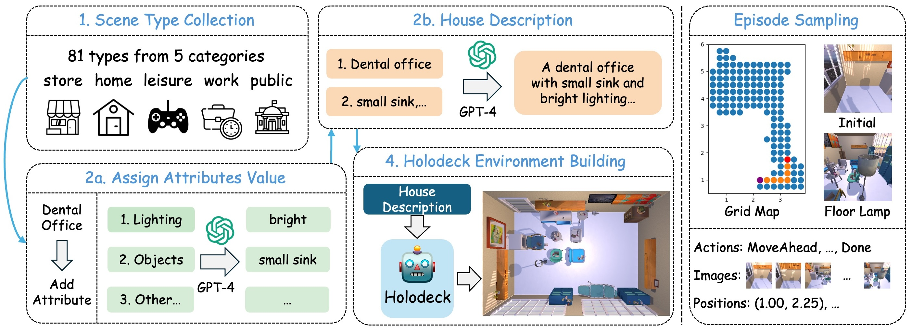

# DivScene: Benchmarking LVLMs for Object Navigation with Diverse Scenes and Objects

This repository is the official implementation of the paper 
[DivScene: Benchmarking LVLMs for Object Navigation with Diverse Scenes and Objects](https://arxiv.org/abs/2410.02730).

<h5 align="center">
  
[](https://github.com/zhaowei-wang-nlp/DivScene/blob/main/LICENSE)
[](https://www.python.org/downloads/release/python-390/)

</h5>

<div align="center">
    
    <br>
    <span>An illustration of the data curation.</span>
</div>


## Requirements
### Embodied Environment
DivScene is built on the simulator AI2-THOR on MacOS with 
the Python version 3.9.16.
You can find the requirement in the github repository of Holodeck
and follow their instructions to build the environment. 
Specifically, the commit we used is ```156f8e10``` at the [link](https://github.com/allenai/Holodeck/blob/156f8e1077ba5811bbe613f9d65b8f66c48f2346)
### Embodied Agent
We train and test our agent NatVLM with the Megatron-LM framework on Linux (CentOS).
The requirements are shown in ```requirement.txt```.

## DivScene Data
In our work, we build a new scene dataset ```DivScene``` with 4614 houses with 81 distinct scene types. 
The data ```DivScene.zip``` are released at [DivScene-DivTraj](https://huggingface.co/datasets/ZhaoweiWang/DivScene-DivTraj) on HuggingFace Hub.
You can use ```unzip``` and ```7z``` commands to extract house jsons from the zip file. The split of training/validation/test are shown in ```split_file.json```.

**Notice:** our houses are built using Holodeck so that you need to config the [objaverse asset](https://github.com/allenai/objathor) correctly.

**Build new houses:** 
1) Gather the textual house descriptions with the code in ```sample_data/gather_gpt4_prompt```. 
2) Input those descriptions in Holodeck.
3) Use the ```sample_data/regenerate_init_position.py``` to search a valid init position of the embodied agent.

## DivTraj Data
Similarly, the episodes of shortest paths we sampled are at [DivScene-DivTraj](https://huggingface.co/datasets/ZhaoweiWang/DivScene-DivTraj) on HuggingFace Hub.
There are 5 episodes per house in the training set and 4 episodes per house in validation and test sets.

**Format of episode name:** ```{house_id}-{traj_id}```

**New episodes sampling:** Use the ```sample_data/generate_trajectories.py``` to generate more trajectories.

## Training Models
### 1. Prepare Data: We revise our training code based on [Megatron-LM](https://github.com/NVIDIA/Megatron-LM) framework and [Pai-Megatron](https://github.com/alibaba/Pai-Megatron-Patch).
We provide a Large Vision Language Models (LVLM) with the instruction of a step and ask it to generate the next step. Here, we follow the instruction data format of 
[Llava](https://github.com/haotian-liu/LLaVA). We use ```convert_to_llava_format_with_pos_cot.py``` to convert ```DivTraj``` trajectories into the Llava format and
also list useful commands in ```convert_to_llava_format.sh```.

### 2. Train Model:
1. First, use ```webdataset``` to compress the data. The script is ```agent_training/toolkits/pretrain_data_preprocessing/move_bulk_data.py```. ```webdataset``` can speed up the data loading when training the model.
2. The training script is ```agent_training/examples/idefics2/train_llava_instruct_webdataset_cot.sh```. We also leave some commands in ```agent_training/examples/idefics2/run_cot_cmd.sh```
3. Please use code in ```model_checkpoints_convertor``` to convert the model between huggingface format and megatron format.

**LICENSE ISSUE:** We released our revision of [Pai-Megatron](https://github.com/alibaba/Pai-Megatron-Patch) and [Megatron-LM](https://github.com/NVIDIA/Megatron-LM). 
If you use those code, all licenses are subject to their original release.

## Inference
We conduct the inference with the model-serving mode. We deploy trained LVLM on Linux servers. 
Then, we run the AI2-THOR on MacOS and call the api of the LVLM to finish navigation.
1) See commands in ```agent_inference/run_server.sh``` to deploy the model with FastAPI.
2) Run commands in ```agent_inference/run_client.sh``` on MacOS with AI2-THOR to test your model.

## Citation

Please cite the repo if you use the data or code.
```
@inproceedings{wang2024divscenebenchmarkinglvlmsobject,
title={DivScene: Benchmarking LVLMs for Object Navigation with Diverse Scenes and Objects}, 
author={Zhaowei Wang and Hongming Zhang and Tianqing Fang and Ye Tian and Yue Yang and Kaixin Ma and Xiaoman Pan and Yangqiu Song and Dong Yu},
year={2024},
eprint={2410.02730},
archivePrefix={arXiv},
primaryClass={cs.CV},
url={https://arxiv.org/abs/2410.02730}
}
```

## Contributing
This repo is maintained by [Zhaowei Wang](https://zhaowei-wang-nlp.github.io/)